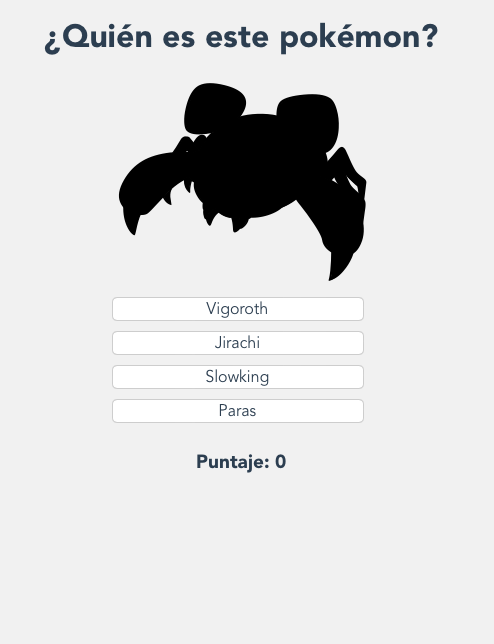
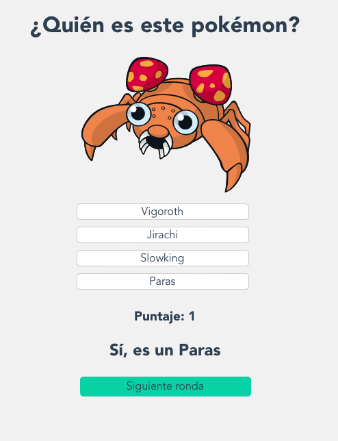

    

<h1 id="menu">
  
  Pokemon Game
</h1>

This project is a pokemon game. You should guess which pokemon is it in every round.
You can see the project here → [Pokemon Game](https://pokemon.alexcamachogz.tech).

## Table of contents

- [Menu](#menu)
- [Preview](#preview)
- [Technologies](#technologies)
- [Author](#author)

<h2 id="preview">
  
  Preview
</h2>

| Question | Answer |
| --- | ----------- |
|  |  |

<h2 id="technologies">
  
  Technologies
</h2>

1. HTML
2. CSS vanilla
3. Vue3 with JavaScript
4. Unit testing with Jest

<h2 id="author">
  
  Author
</h2>

**Alex Camacho** - [@alexcamachogz](https://twitter.com/alexcamachogz)
